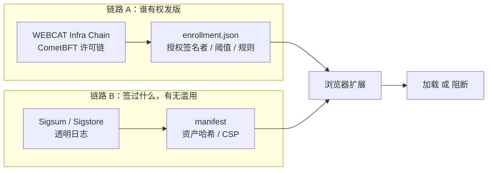
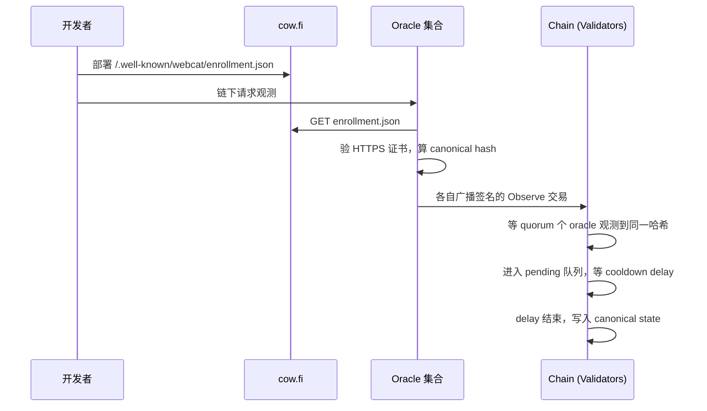
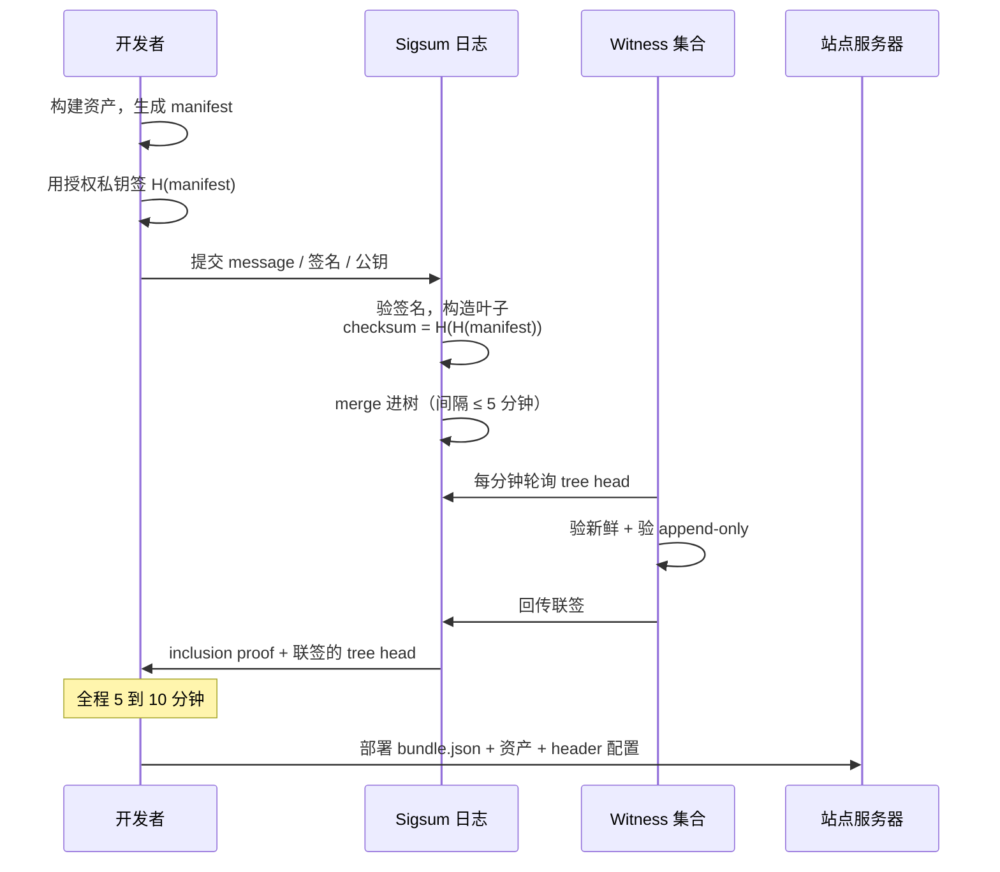
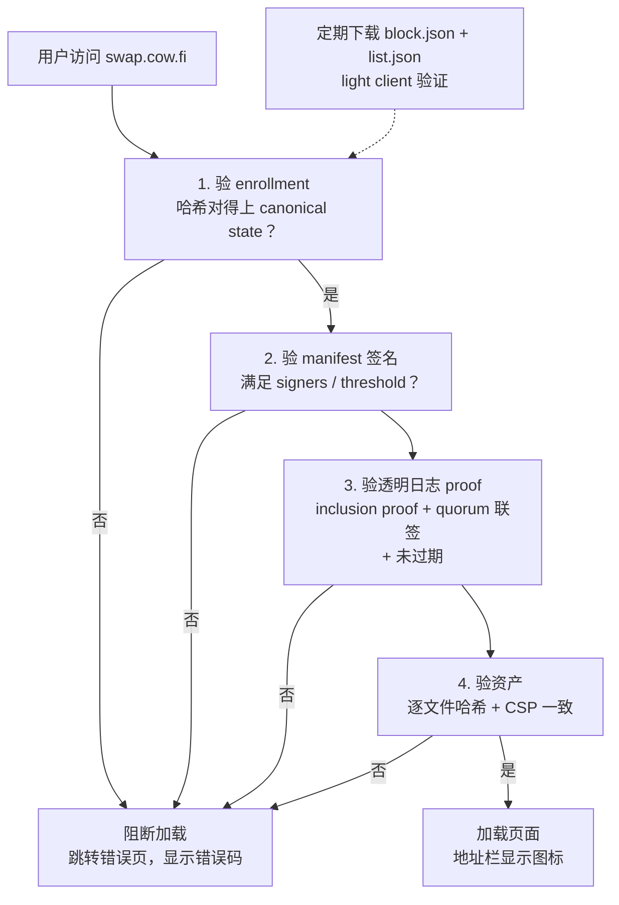
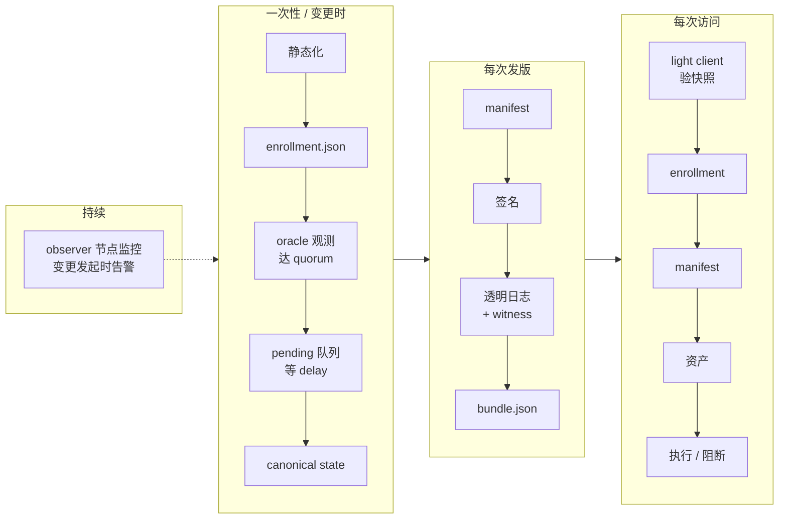

# WEBCAT 是怎么工作的

WEBCAT 是 Freedom of the Press Foundation 开发的前端代码完整性方案，起源于 SecureDrop 的需求，2026 年 8 月获得 EF 的 1TS grant 资助，用于扩展到 Ethereum 钱包和 dapp 场景。

关键论断都附了出处，完整清单见文末第 9 节。

> **注意**：ePrint 论文（2025/797）描述的是**上链之前的旧架构**，其中 enrollment server 是单点。当前架构已用 oracle 集合 + CometBFT 链取代。本文以官方文档和 spec 为准。

---

## 1. 它解决什么问题

HTTPS 只证明"你连到了 cow.fi 这台服务器"，不证明"这台服务器发给你的 JS 就是开发者写的那份"。

服务器被入侵、CDN 被投毒、DNS 被劫持、构建流水线被污染，浏览器都会毫无怨言地执行送过来的代码。对 dapp 来说，这意味着攻击者可以静默替换交易的接收地址，或者让签名弹窗显示的内容和实际签的东西不一致。

WEBCAT 补上的就是这个缺口：**让浏览器能验证站点提供的代码就是开发者签名发布的那份，验不过就拒绝执行。**

---

## 2. Big Idea：一分钟看懂

浏览器扩展在**执行任何代码之前**，要验证一条从"公开记录"一直连到"页面上每个文件"的哈希链。要建起这条链，必须回答两个问题：

1. **哪些密钥可以代表 cow.fi 发布新版本？**
2. **这些密钥都签署过什么，有没有被滥用？**

两个答案都不能只从 cow.fi 的服务器上拿，否则服务器一旦被攻陷，攻击者把答案也一起改了就行。所以两个答案**都必须锚定到站点之外的公开记录上**。

WEBCAT 为这两个问题各配了一套公开记录系统：



用户每次访问，扩展跑四段验证，顺序固定，每段的信任来自上一段：

```
1. 链的状态快照    ← 定期下载，light client 验证
2. enrollment      ← 哈希对得上快照里 cow.fi 那条记录
3. manifest        ← 签名满足 enrollment 声明的签名者和阈值
                     + 这次签名确实被公开记录过（链路 B）
4. 每个资产        ← 哈希对得上 manifest，CSP 对得上 manifest
```

任何一段失败，页面加载直接中止。

**三个要点：**

- 链路 A 是**一条许可制 BFT 链**，回答"谁有权发版"
- 链路 B 是**透明日志**（Sigsum 或 Sigstore），回答"签过什么，有无滥用"。后半截日志本身回答不了：它只负责让每次签名都无法私下进行，至于某条记录该不该存在，只有知道真相的开发者才判断得了。所以这一问实际是**透明日志 + monitor 一起回答的**，日志保证证据一定存在，monitor 负责把记录和自己实际发布过的版本做比对。密码学不保证有人去读
- 服务器上**没有私钥**，签名全在开发者侧离线完成，服务器被攻陷的后果是拒绝服务，而非投毒

值得先说破的一点：**链路 A 的客户端验证本质上就是 light client**，验共识签名加 Merkle proof，和我们验 Ethereum 状态是同一套模式。

---

## 3. 流程一：Enrollment（一次性 + 变更时）

回答"谁有权发版"。

> 出处：[key-entities](https://docs.webcat.tech/architecture/enrollment-infrastructure/key-entities.html) · [正式 spec](https://github.com/freedomofpress/webcat-spec/blob/main/enrollment.md) · [server.md](https://github.com/freedomofpress/webcat-spec/blob/main/server.md) · [时序图](https://github.com/freedomofpress/webcat-infra-chain/blob/main/docs/seq_diag.md)



### 前提：应用必须完全静态

前端完全静态（无服务端生成的 HTML/JS/CSS）、不允许 inline JavaScript、CSP 必须通过 HTTP header 提供且满足特定约束（[webcat-cli](https://github.com/freedomofpress/webcat-cli)）。

原因是整套机制的基础是"每个资产有确定的哈希"，动态生成的脚本无法被预先承诺。这个约束对我们是免费满足的，前端要上链本来就得是静态文件。

### enrollment.json 里写什么

站点在 `https://<domain>/.well-known/webcat/enrollment.json` 发布，是服务器上的一个普通静态文件，任何人可下载。

| 字段 | 作用 | 我们熟悉的对应物 |
|---|---|---|
| `signers` | 授权签名身份（Sigsum 公钥，或 Sigstore 的 OIDC identity + issuer） | multisig 的 owner 集合 |
| `threshold` | 需要几个有效签名 | multisig 的 m-of-n |
| `policy` | 编译后的 Sigsum trust policy：认可的**日志列表**、**witness 列表**、以及一条全局 quorum 规则 | 认可哪条链 + 共识阈值 |
| `logs` | 日志公钥到 URL 的映射，从 policy 派生，供 monitor 定位日志 | RPC 端点列表 |
| `max_age` | manifest 的有效期秒数 | 防重放的过期时间 |
| `cas_url` | 内容寻址存储地址，供第三方审计取回历史版本，不在验证路径上 | 数据可用性层 |

两点值得注意：

- **witness 集合是每个站点自己声明的**（在 `policy` 里），不是扩展硬编码的。Sigsum 刻意不管"谁是可信 witness"，WEBCAT 把这个决定权下放给了域名。灵活，但意味着一个站点理论上可以声明一组自己控制的 witness。
- **policy 可以列多个日志，但 quorum 只有一条、且是全局的**，作用于 tree head 上的联签，与 proof 来自哪个日志无关。witness 和 log 在 Sigsum 的模型里是解耦的，一个 witness 可以给多个日志联签。（per-log quorum 目前不支持，WEBCAT 作者在 Sigsum 邮件列表里提过希望有。）

### Oracle 观测与 cooldown

域名所有者通过[注册前端](https://enroll.webcat.tech)向 oracle 集合发起链下请求。每个 oracle **独立**抓取 enrollment.json、**验证 HTTPS 证书**、算出规范化 JSON 的 SHA-256，然后用自己的 ECDSA P-256 密钥签一笔 `Observe` 交易广播上链。返回 404/410 则记为 `NotFound`，用于注销。

> **信任链底部落在 DNS + CA 上。** 谁能劫持 DNS 或拿到伪造证书，谁就能骗过 oracle。这是他们架构上的既定选择。

链上的处理是一个投票队列：累积到 `quorum` 个 oracle 对同一域名投出同一哈希 → 胜出值进入 **pending 队列** → 等待 `delay`（即 cooldown）→ 在 `EndBlock` 时提升为 canonical state。

**cooldown 的巧妙之处在于覆盖规则**：同一域名有新值达到 quorum 时，新值覆盖 pending 中的旧值并**重置计时器**；但新值与 pending 值相同时不重置（防 DoS）。

含义是：**撤销恶意变更不需要特殊的回滚接口。** 域名所有者被告警后，推一个正常更新走同样流程即可覆盖掉恶意的 pending 项。

（cooldown 时长是链参数 `voting_config.delay`，不是固定的 7 天。）

### 链本身

- **CometBFT + ABCI**，执行层是 Rust 写的 `felidae` 应用。没有代币、没有 gas、没有 Cosmos SDK，只取 BFT 共识这一个原语
- **validator 许可制**，需人工授权。spec 写明投票网络由"可信的合作组织（其他非营利组织、Tor relay 协会、浏览器厂商）"担任
- **canonical state** 是"域名 → enrollment 哈希"的映射。它的对外发布快照叫 **preload list**，是扩展消费的那一份，见 5.1
- **任何第三方都可以运行 observer 节点**，做和 validator 一样的检查

最后一条很重要：**监控能力是内建的**，不需要另建 monitor 生态。链本身就是 enrollment 变更的透明日志，非 validator 节点即可支持"变更发起时告警域名所有者"的服务和独立审计（[Transparency](https://docs.webcat.tech/architecture/enrollment-infrastructure/transparency.html)）。但 manifest 签名仍需透明日志，那是链路 B 的事。

---

## 4. 流程二：发布新版本（每次发版）

回答"签过什么，有无滥用"。这一节引入 WEBCAT 里我们最陌生的构件：透明日志。

### 4.1 先理解透明日志

> 出处：[Sigsum design doc](https://git.sigsum.org/sigsum/plain/doc/design.md)

一句话定义：**一棵 append-only 的 Merkle 树，由单一运营方维护，对外提供证明。**

拿区块链做参照最快，因为**数据结构和证明方式完全一样**，`inclusion proof` 证明"叶子 X 在根 R 里"，`consistency proof` 证明"新根是在旧根基础上纯追加得来的"。

区别在于它**只有账本这一层，没有一个机制来保证"只存在一份历史"**：

| | 区块链 | Transparency log |
|---|---|---|
| 数据结构 | Merkle 树 | Merkle 树，相同 |
| 谁写入 | 无许可，竞争出块 | 单一运营方，一台服务器 |
| 谁保证只有一份历史 | 共识 | **没有内建机制** |
| 提供什么 | 状态正确 | 只保证记录公开且不可撤回 |
| 成本 | 高 | 一个 HTTP 服务 |

还有一点：**它不判断对错。** 日志不知道写进来的东西是好是坏，恶意内容照收不误。它唯一的承诺是：一旦记录进去，就永久公开、不可删改。所以透明日志提供的是**检测**，不是**阻止**。

### 4.2 它唯一的攻击面：split-view

上面那个缺失直接对应一种作恶方式：运营方**维护两棵树**。给普通用户看树 A（正常），给受害者看树 B（含恶意记录）。两棵树各自内部自洽，Merkle proof 都能验过。受害者以为"这东西已公开可查"，但监控方那边根本看不到。

Merkle 结构对此无能为力，因为问题不在树的结构，在于"到底哪棵才是那棵树"。

**"只存在一份历史"正是共识负责的事。** Sigsum 没有共识层，只能用别的办法把这个性质补回来，这是理解它全部复杂度的钥匙，也是 4.6 里 witness 存在的全部理由。

### 4.3 完整流程



### 4.4 manifest 是什么

> 出处：[manifest.md](https://github.com/freedomofpress/webcat-spec/blob/main/manifest.md)

一份 JSON，顶层是 `manifest` 和 `signatures` 两个对象。

`manifest` 里最关键的是 `files`（相对路径到 SHA-256 哈希的映射）和 `default_csp`（可用 `extra_csp` 按路径前缀覆盖）；此外还有 `default_index`、`default_fallback`（SPA 兜底）、`wasm`、`timestamp`、`app` / `version`。

`signatures` 把 Ed25519 公钥映射到对应的 Sigsum proof。验证规则：签名针对规范化后的 `manifest` 对象，必须有至少 `threshold` 个有效签名与 proof，每个 proof 都要满足 enrollment 里的 policy。

**只签 manifest 就够了**，因为它承诺了构成整个应用的所有资产，这些资产就继承了同样的安全属性（[论文](https://eprint.iacr.org/2025/797.pdf)）。一次签名覆盖成百上千个文件，日志里也只多一条记录。

CSP 之所以进 manifest，是因为服务器返回的 header 不属于任何被哈希的文件，需要单独锁死；实际返回值必须与 manifest 一致，否则报 `ERR_WEBCAT_CSP_MISMATCH`。

### 4.5 Sigsum 做了什么

> 出处：[Sigsum design doc](https://git.sigsum.org/sigsum/plain/doc/design.md)

**签的是哈希的哈希。** 提交给日志的 message 是 `H(manifest)`，日志再哈希一次，进树的是 `H(H(manifest))`。目的是防日志投毒，以及让日志看不到内容。

**副作用很重要：日志无法做任何内容检查。** 它眼里只有 32 字节随机数，不知道这是 cow.fi 的、不知道 CSP 有没有被放宽、不知道有没有多出恶意资产。

**日志不签发任何承诺。** 提交后必须等叶子真正并进树才能拿到 inclusion proof，因此无法保证低延迟。这让协议省掉了一整套"事后核对承诺是否兑现"的审计逻辑，代价是要等。

### 4.6 witness 怎么补上共识那一块

回到 4.2 的 split-view 问题。Sigsum 的解法是引入一组独立的 witness：每分钟轮询日志的 tree head，检查它**新鲜**（不超过 5 分钟）且**相对上次是纯追加的**（consistency proof 验过），通过才联签。

**关键在于 witness 是有状态的。** 它记得自己上次签过哪个 head，只接受能给出 consistency proof 的后继。所以一个 witness 一旦跟上某条分支，就被锁死在那条分支上了。

客户端只接受凑够 quorum 联签的 tree head。推一下：每个 witness 只能跟随一条分支；攻击者要让两条分支都被接受，就得在两个 head 上各凑够 quorum。所以只要 **quorum 超过 witness 总数一半，split-view 在数学上不可能**。

这就是 BFT 的 quorum intersection。**witness 联签是一个被削到最小的共识层**，专门补上透明日志缺失的那一块。

### 4.7 这一步换来了什么

攻击者拿到发布密钥后，只剩两个选择：

- **不走日志直接签** → 用户拿不到 proof，验证失败
- **老实走日志** → 签名永久公开，日志里出现一条官网上不存在的 release

这就是全部价值：**把攻击从"不可察觉"变成"必然留痕"**。它不阻止密钥被盗后签出恶意版本，只保证这件事一定留下公开证据。

### 4.8 bundle.json

打包成 `/.well-known/webcat/bundle.json`，含 enrollment + manifest + signatures + proofs。刻意冗余地内嵌 enrollment，是为了让扩展**一次请求拿到全部验证材料**，之后纯本地计算。

**服务器上没有私钥。** 签名全在开发者侧离线完成，托管方无需特殊信任或密钥（论文称之为 separation-of-concerns 模型）。所以服务器被完全攻陷的后果是**拒绝服务，而非投毒**。

---

## 5. 流程三：客户端验证（每次访问）

> 出处：[Preload List](https://docs.webcat.tech/architecture/enrollment-infrastructure/preload-list.html) · [时序图](https://github.com/freedomofpress/webcat-infra-chain/blob/main/docs/seq_diag.md) · [for-users](https://docs.webcat.tech/for-users.html)

### 5.1 扩展怎么拿到链的状态

**preload list** 是链上 canonical state 导出成的文件。扩展跑不了全节点，所以有人把这份状态导出来发布，扩展定期下载。

名字来自浏览器的 HSTS preload list：内置一份域名清单，让浏览器在**第一次访问之前**就知道该怎么对待这个域名。必须预加载而不是现查，因为验证要发生在代码执行前（时序）、现查等于把浏览记录送出去（隐私）、且拿到后要能全本地判断（离线）。这也解释了为什么非注册域名也有 2% 开销：每访问任何网站都要在列表里查一次。

发布两个文件：`block.json` 是 CometBFT 的 `LightBlock`，`list.json` 是状态快照，含重建状态树所需的叶子和一份到 `AppHash` 的 Merkle proof。

**没有人给这两个文件额外签名。** validator 签的是区块，而 `AppHash`（Merkle 化的应用状态根）就在区块头里，这是共识本来就要做的事。所以发布者不必是 validator，也不需要可信，它就是个 CDN。

客户端的验证：

```
1. 验 LightBlock 的签名        ← >2/3 投票权
2. 从叶子重建状态树，得到 canonical root
3. 用 Merkle proof 把 canonical root 连到 app_hash
4. 确认这个 app_hash 就在 LightBlock 的 header 里
```

**这就是标准 light client：验共识签名 + 验状态 Merkle proof。** 和我们用 Colibri 验 Ethereum 状态是同一套模式，只是链不同。

### 5.2 四段验证



**验证发生在执行之前。** fail-closed，验不过直接阻断页面加载，而不是显示警告让用户自己判断。论文专门论证了这一点：对代码完整性来说，"先执行再告警"等于没有保护。

**第 3 段完全离线。** proof 已随 bundle 送达，扩展只是本地重算 Merkle 路径、验签名、数联签够不够 quorum。日志停机不影响已分发的 proof。

**对外请求只有那两个快照文件**，且与访问哪个站点无关，因此不泄露浏览记录。

### 5.3 工程约束

- 扩展无外部运行时依赖，密码学只用 Web Crypto API；运行时策略执行交给浏览器原生 CSP
- 目前仅 Firefox；Firefox for Android 未测试，Tor Browser 已知不工作。EF grant 会资助 Chromium 支持研究
- 性能开销：已注册域名冷启动最高 20%，非注册域名 2%；热启动 25% / 5%
- 目前是 alpha 阶段，[官方明说](https://securedrop.org/news/webcat-alpha/)可能还不能提供预期的安全保证

---

## 6. 全景



---

## 7. 术语速查

| 术语 | 是什么 |
|---|---|
| enrollment | 站点声明的授权签名者和验证规则，站点上的静态 JSON |
| oracle | 独立抓取并验证 enrollment.json、向链提交签名观测的实体 |
| canonical state | 域名到 enrollment 哈希的映射，链的核心状态 |
| preload list | canonical state 的对外快照，扩展消费的那份 |
| cooldown / delay | pending 变更生效前的等待时长，链参数 |
| LightBlock | CometBFT 的轻客户端区块，含 AppHash 和 validator 签名 |
| manifest | 描述全部资产哈希和 CSP 的 JSON，每次发版签一份 |
| bundle | enrollment + manifest + 签名 + proof 打包 |
| Sigsum | 透明日志方案，自持 ed25519 密钥，靠 witness 联签防 split-view |
| Sigstore | 另一条路，临时密钥 + OIDC 身份（GitHub/Google 账号）+ Rekor 日志 |
| witness | 独立第三方，持续验证日志 append-only 并联签 tree head |

---

## 8. 对照我们的方案

| WEBCAT 的组件 | 我们的对应物 |
|---|---|
| enrollment 的 signers / threshold | dapp 自己的 multisig |
| cooldown delay | timelock |
| CometBFT 链 + LightBlock light client | Ethereum + Colibri light client |
| oracle quorum 观测 DNS/HTTPS | 合约 owner 权限，链上原生 |
| witness 联签防 split-view | L1 共识 |
| observer 节点监控 | 链上事件订阅 |
| manifest（关于内容的承诺） | 内容本身即链上状态，少一层间接 |

三点判断：

**一，架构上比想象中接近。** 他们的扩展已经在做 light client 验证（验 2/3 共识签名 + 状态 Merkle proof），只是验的是一条自建的许可链。把链路 A 的信任根换成 Ethereum，**验证模式不用变，换的是 light client 实现和 proof 格式**。这让"贡献一个 Ethereum 后端"在工程上是现实的。

**二，差别收窄但仍成立。** 他们的 enrollment 层不是脆弱单点，有 BFT 共识、oracle quorum、内建监控。真正的差别落在三处：

- **许可 vs 无许可**：validator 需人工授权，安全性上限取决于这个集合的规模和独立性
- **自建 vs 复用**：他们要长期维护 validator 和 oracle 两套集合；我们复用已有的 L1 安全性
- **身份锚定**：他们的 oracle 验的是 HTTPS 证书，底部是 DNS + CA；合约 owner 是链上原生的授权关系

**三，WEBCAT 只保护完整性，不保护可用性。** 内容始终在原服务器上，服务器被拔掉、域名被扣、CDN 区域封锁，用户就是打不开。链上托管额外提供抗审查：任何人可起 gateway 服务同一份内容，验证结果相同。这是两个不同的属性。

---

## 9. 出处清单

**官方文档**

- 文档站 https://docs.webcat.tech/
- 概念术语表 https://docs.webcat.tech/concepts.html
- 用户视角与错误码表 https://docs.webcat.tech/for-users.html
- Enrollment 架构 https://docs.webcat.tech/architecture/enrollment-infrastructure/index.html
- 关键实体与行为 https://docs.webcat.tech/architecture/enrollment-infrastructure/key-entities.html
- Preload list https://docs.webcat.tech/architecture/enrollment-infrastructure/preload-list.html
- Transparency 与监控 https://docs.webcat.tech/architecture/enrollment-infrastructure/transparency.html

**规范与代码**

- Enrollment spec https://github.com/freedomofpress/webcat-spec/blob/main/enrollment.md
- Server / enrollment.json 字段定义 https://github.com/freedomofpress/webcat-spec/blob/main/server.md
- Manifest 格式 https://github.com/freedomofpress/webcat-spec/blob/main/manifest.md
- 时序图 https://github.com/freedomofpress/webcat-infra-chain/blob/main/docs/seq_diag.md
- 链实现（Rust / CometBFT） https://github.com/freedomofpress/webcat-infra-chain
- 扩展主仓库 https://github.com/freedomofpress/webcat
- 开发者 CLI https://github.com/freedomofpress/webcat-cli
- 注册前端 https://enroll.webcat.tech

**论文与公告**

- WEBCAT 论文（注意描述的是旧架构）https://eprint.iacr.org/2025/797
- Alpha 发布公告 https://securedrop.org/news/webcat-alpha/
- EF 1TS grant 公告 https://blog.ethereum.org/2026/08/05/1ts-grant

**Sigsum**

- 官网 https://www.sigsum.org/
- Getting started（含 trust policy 文件格式示例）https://www.sigsum.org/getting-started/
- Design doc https://git.sigsum.org/sigsum/plain/doc/design.md

**已知不确定处**

- manifest 的 `timestamp` 字段，manifest.md 说是 Sigsum 联签 tree head，enrollment.md 和 server.md 说是对照 CometBFT 的 `AppHash` 验证。两份 spec 说法不一致，未能确认现行实现是哪一种。
- 快照发布频率：preload-list 页写每天，enrollment spec 写 LightBlock 每小时发到 CDN。
- `docs.webcat.tech` 的 site-operators 与 webapp-developers 两页抓取受限，未核实。
